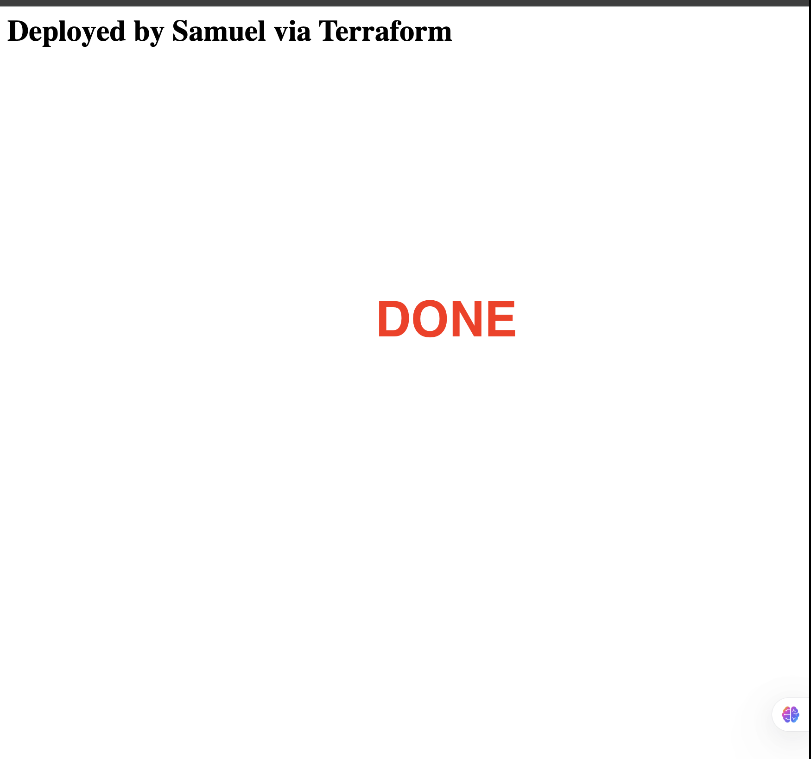
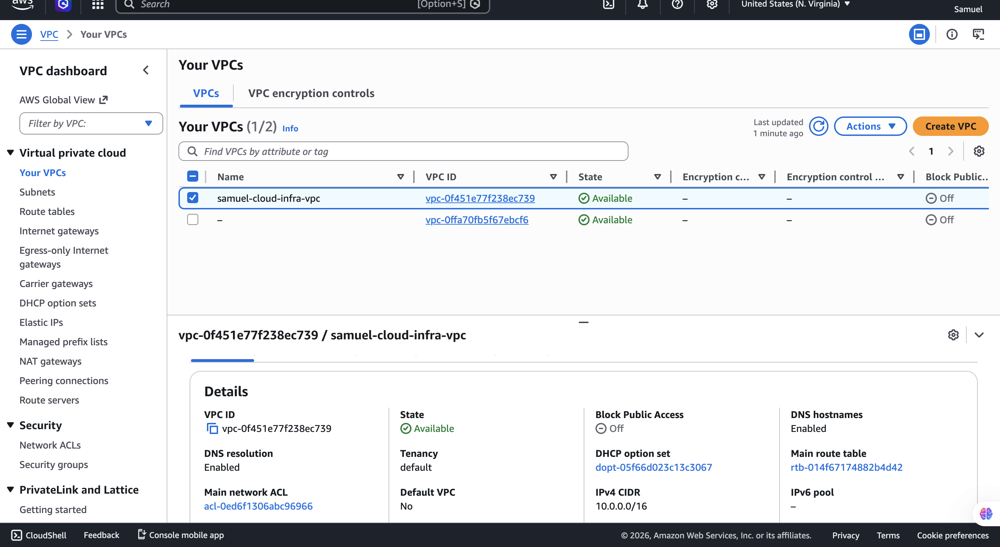

# Terraform-AWS-infrastructure
Multi-tier AWS infrastructure provisioned with Terraform — VPC, EC2, RDS, security groups, and CI/CD pipeline via GitHub Actions

# Terraform AWS Infrastructure

A production-style multi-tier AWS environment provisioned entirely with Terraform Infrastructure as Code (IaC), with automated deployments via GitHub Actions CI/CD pipeline.

---

## Live Demo

Visit the deployed web server: `http://98.92.119.166/`

---

## Architecture

```
Internet
    │
    ▼
Internet Gateway
    │
    ▼
┌─────────────────────────────────┐
│         VPC (10.0.0.0/16)       │
│                                 │
│  ┌──────────────────────────┐   │
│  │     Public Subnet        │   │
│  │   (10.0.1.0/24)          │   │
│  │                          │   │
│  │  ┌────────────────────┐  │   │
│  │  │  EC2 Web Server    │  │   │
│  │  │  (t3.micro)        │  │   │
│  │  │  Apache HTTP       │  │   │
│  │  └────────┬───────────┘  │   │
│  └───────────┼──────────────┘   │
│              │                  │
│  ┌───────────▼──────────────┐   │
│  │     Private Subnet       │   │
│  │   (10.0.2.0/24)          │   │
│  │                          │   │
│  │  ┌────────────────────┐  │   │
│  │  │   RDS MySQL 8.0    │  │   │
│  │  │   (db.t3.micro)    │  │   │
│  │  └────────────────────┘  │   │
│  └──────────────────────────┘   │
└─────────────────────────────────┘
```

---

## Technologies Used

- **Terraform** v1.14.8 — Infrastructure as Code
- **AWS VPC** — isolated private network
- **AWS EC2** — t3.micro web server running Apache
- **AWS RDS** — MySQL 8.0 managed database (private subnet)
- **AWS Security Groups** — firewall rules controlling traffic
- **GitHub Actions** — CI/CD pipeline for automated deployments

---

## Project Structure

```
terraform-aws-infra/
├── provider.tf          # AWS provider configuration
├── variables.tf         # Input variables
├── main.tf              # Core infrastructure resources
├── outputs.tf           # Output values (IP, DB endpoint)
└── .github/
    └── workflows/
        └── deploy.yml   # GitHub Actions CI/CD pipeline
```

---

## Infrastructure Resources

| Resource | Description |
|----------|-------------|
| `aws_vpc` | Virtual Private Cloud with DNS enabled |
| `aws_subnet` (public) | Public subnet in us-east-1a |
| `aws_subnet` (private) | Private subnet in us-east-1b |
| `aws_internet_gateway` | Internet access for the VPC |
| `aws_route_table` | Routes public traffic to internet gateway |
| `aws_security_group` (web) | Allows HTTP (80) and SSH (22) inbound |
| `aws_security_group` (db) | Allows MySQL (3306) from web server only |
| `aws_instance` | EC2 web server with Apache auto-installed |
| `aws_db_subnet_group` | Subnet group for RDS placement |
| `aws_db_instance` | MySQL 8.0 RDS instance in private subnet |

---

## How to Deploy

### Prerequisites
- AWS account with IAM user credentials
- Terraform installed (`brew install hashicorp/tap/terraform`)
- AWS CLI configured (`aws configure`)

### Steps

```bash
# 1. Clone the repository
git clone https://github.com/Samuelaliu/terraform-aws-infra.git
cd terraform-aws-infra

# 2. Initialize Terraform
terraform init

# 3. Preview the infrastructure
terraform plan -var="db_password=YOUR_PASSWORD"

# 4. Deploy
terraform apply -var="db_password=YOUR_PASSWORD"
```

### Destroy (to avoid AWS charges)
```bash
terraform destroy -var="db_password=YOUR_PASSWORD"
```

---

## CI/CD Pipeline

Every push to the `main` branch automatically triggers a GitHub Actions workflow that:

1. Checks out the code
2. Sets up Terraform
3. Runs `terraform init`
4. Runs `terraform apply` using secrets stored in GitHub

### Required GitHub Secrets

| Secret | Description |
|--------|-------------|
| `AWS_ACCESS_KEY_ID` | IAM user access key |
| `AWS_SECRET_ACCESS_KEY` | IAM user secret key |
| `DB_PASSWORD` | RDS database password |

---

## Screenshots

### Web Server Live


### AWS Console — EC2 Instance


### AWS Console — VPC


### GitHub Actions — Pipeline Running


---

## Challenges & How I Fixed Them

**1. t2.micro not Free Tier eligible**
AWS recently changed free tier eligibility. Fixed by switching instance type from `t2.micro` to `t3.micro` in `main.tf`.

**2. RDS password rejected**
AWS RDS does not allow `@` in passwords. Fixed by using a password with only alphanumeric characters.

**3. VPC resources already existed on retry**
After the first failed apply, Terraform retained state for the successfully created resources. On the second apply, Terraform correctly detected the existing resources and only created the 2 remaining ones (EC2 and RDS).

---

## Lessons Learned

- Terraform's state management is powerful — it tracks what's already built and only creates what's missing
- Security groups should follow the principle of least privilege — the DB security group only allows traffic from the web server, not the open internet
- RDS takes significantly longer to provision than EC2 (5+ minutes vs 30 seconds)
- Always use `.gitignore` to exclude `.tfstate` files — they contain sensitive infrastructure details

---

## Author

**Samuel** — IT Support Specialist & Cloud Infrastructure Engineer  
[GitHub](https://github.com/Samuelaliu) • [LinkedIn](https://www.linkedin.com/in/aliusamuel/)
